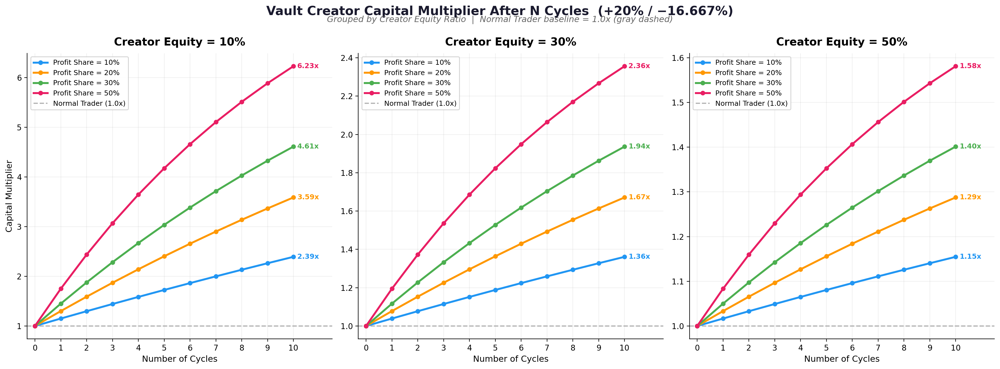

# Pourquoi les autres gagnent et vous perdez ? — Le mécanisme de Vault que la plupart des gens ignorent

Sur les marchés de trading, certains génèrent des profits constants tandis que d'autres subissent des pertes répétées. La plupart des gens attribuent cela à des « compétences insuffisantes » ou une « mauvaise mentalité », mais le véritable problème fondamental est en réalité plus profond : **disposez-vous d'un avantage relatif structurel ?**

## L'essence du profit : l'avantage relatif

Les marchés de trading sont un terrain de jeu à somme zéro. L'argent que vous gagnez, c'est nécessairement celui que quelqu'un d'autre perd. Pour survivre et générer des profits sur ce marché impitoyable, vous n'avez pas besoin de capacités écrasantes, mais plutôt **ne serait-ce qu'un léger avantage relatif**.

Les initiés exploitent l'**asymétrie informationnelle** — ils savent ce qui va se passer avant vous. Les équipes de trading quantitatif exploitent la **vitesse et la discipline** — les algorithmes prennent des décisions à l'échelle de la milliseconde, éliminant complètement l'interférence émotionnelle humaine. Les arbitragistes rivalisent sur l'**avantage des frais** — sur Binance, un teneur de marché VIP9 peut obtenir un taux de frais maker aussi bas que 0,011%, tandis que VIP6 paie 0,04%. Cette seule différence suffit pour que l'arbitragiste VIP9 génère un profit stable, tandis que la même stratégie pour VIP6 entraîne une perte. Les teneurs de marché jouissent d'un avantage structurel de **frais maker nuls et levier faible**.

Même dans les casinos, l'avantage du croupier n'est rien de plus qu'une légère inclinaison des règles — le croupier gagne en cas d'égalité. Mais cette infime inclinaison, répétée des milliers de fois, se transforme en profit certain.

Voici donc la question : **quel est votre avantage relatif en tant que trader ordinaire ?**

Si votre réponse est « je suis bon en trading » ou « je lis bien le marché », je vous conseille de vous arrêter et d'y réfléchir sérieusement. Il y a beaucoup de gens meilleurs que vous au trading, et il y a certainement des algorithmes plus précis que vous. Acquérir un avantage durable par jugement subjectif est extrêmement difficile.

## L'avantage structurel que j'ai découvert : le mécanisme de Vault

Récemment, j'ai étudié en profondeur les mécanismes de Vault de Hyperliquid et DipCoin, et j'ai découvert un avantage structurel extrêmement puissant que la plupart des gens ignorent.

Le modèle fondamental du Vault est le suivant : vous créez un Vault en tant que Creator, et d'autres personnes (Depositors) peuvent y déposer des fonds pour suivre votre stratégie de trading ensemble. À première vue, ce n'est qu'un outil de « copy-trading », mais le mécanisme fondamental est essentiellement différent du copy-trading ordinaire.

Le Vault m'attire principalement pour deux raisons :

**Premièrement, vous pouvez utiliser les fonds des Depositors pour amplifier l'échelle de vos transactions.** Supposons que vous ayez 100 000 dollars de fonds propres et que le Vault attire 900 000 dollars de dépôts — vous pouvez alors opérer sur 1 million de dollars. Mais l'important n'est pas l'échelle en elle-même.

**Deuxièmement, les pertes sont réparties proportionnellement à la part de chacun, et le Creator touche une part supplémentaire des profits.** C'est là que réside la véritable magie.

Permettez-moi d'illustrer avec des chiffres concrets pourquoi ce mécanisme est si puissant.

## Les mathématiques ne mentent pas : un résultat « non-zéro » dans un jeu à somme zéro

Supposons qu'une stratégie de trading suive ce cycle répétitif : **d'abord un gain de 20%, puis une perte de 16,667%**.

Pour un trader ordinaire, c'est une boucle à somme zéro parfaite :

> 1,0 × 1,20 × (1 − 1/6) = 1,0

Augmentation de 20%, puis baisse de 16,667%, votre argent revient exactement à zéro. Après 1 cycle, 5 cycles, 10 cycles, le résultat est toujours le même — vos fonds ne changent pas.

Mais pour le Creator du Vault, la situation est complètement différente. Parce que lors des profits, vous pouvez prélever une part des profits des Depositors (Profit Share), tandis que lors des pertes, tout le monde partage les pertes proportionnellement, cette **asymétrie** génère un effet de composition extraordinaire au fil de plusieurs cycles.

J'ai réalisé une modélisation mathématique détaillée. Voici le **multiple des fonds du Creator par rapport aux fonds initiaux** (un trader ordinaire reste toujours à 1,0x) après N cycles de « +20% → −16,667% » avec différents paramètres :

| Ratio de partage | Part propre du Creator | 1 cycle | 5 cycles | 10 cycles |
|:---:|:---:|:---:|:---:|:---:|
| 10% | 10% | 1.15x | 1.73x | 2.39x |
| 10% | 30% | 1.04x | 1.19x | 1.36x |
| 10% | 50% | 1.02x | 1.08x | 1.15x |
| 20% | 10% | 1.30x | 2.40x | 3.59x |
| 20% | 30% | 1.08x | 1.36x | 1.67x |
| 30% | 10% | 1.45x | 3.04x | 4.61x |
| 30% | 30% | 1.12x | 1.53x | 1.94x |
| 50% | 10% | 1.75x | 4.17x | **6.23x** |
| 50% | 30% | 1.19x | 1.82x | 2.36x |

Veuillez noter : **le trader ordinaire dans les mêmes conditions de marché reste toujours à 1,0x — ni gains ni pertes.** Alors que le Creator du Vault, simplement grâce à l'avantage structurel, peut réaliser une croissance de 1,15 fois à 6,23 fois.

Le graphique linéaire ci-dessous illustre cette différence plus clairement. Les trois graphiques correspondent respectivement à une part propre du Creator de 10%, 30%, 50%, et chaque ligne représente un ratio de partage différent (10%/20%/30%/50%), la ligne pointillée grise étant la ligne de base du trader ordinaire (toujours 1,0x) :

À partir du graphique, on voit clairement que plus la part propre du Creator est faible (c'est-à-dire plus le levier des fonds des Depositors est important), et plus le ratio de partage est élevé, plus la courbe s'élève de manière spectaculaire. Dans le graphique de gauche (10% de part propre), la ligne avec un ratio de partage de 50% atteint 6,23 fois après 10 cycles — tandis que le trader ordinaire reste sur place.

Ce n'est pas parce que le Creator trade mieux, ce n'est pas parce qu'il lit mieux le marché — c'est parce que le mécanisme du Vault lui confère une **expectation positive structurelle**.

## Espérance mathématique : pourquoi c'est un avantage certain

Si vous connaissez un peu les mathématiques, nous pouvons calculer cet avantage plus précisément.

Supposons que chaque trade ait une probabilité de profit p, avec un rendement positif g et une perte l. Soit X la part propre du Creator et f le ratio de partage.

**Espérance de rendement unique du trader ordinaire :**

$$E_{normal} = p \times (1 + g) + (1 - p) \times (1 - l)$$

**Espérance de rendement unique du Creator du Vault :**

$$E_{vault} = p \times \left[(1 + g) + f \times \frac{1-X}{X} \times g\right] + (1 - p) \times (1 - l)$$

**Avantage d'expectation du Creator :**

$$\Delta E = E_{vault} - E_{normal} = p \times f \times \frac{1-X}{X} \times g$$

Cette formule révèle plusieurs points clés : tant que votre taux de gain p > 0 (peu importe qu'il soit faible), tant qu'il y a des fonds des Depositors dans le Vault (X < 1), le Creator possède une expectation positive. Plus le ratio de partage f est élevé, plus la part propre X est faible, plus le rendement positif g est important, plus cet avantage est prononcé.

En prenant p = 0,5 (taux de gain de 50%, c'est-à-dire trading aléatoire), g = 20%, X = 10% comme exemple : quand f = 10%, l'avantage d'espérance de chaque trade est ΔE = 0,009, ce qui semble minuscule ; quand f = 30%, ΔE = 0,027 ; quand f = 50%, ΔE = 0,045.

Ces avantages minuscules, composés et accumulés sur des dizaines, des centaines de trades, sont la source de ces chiffres stupéfiants dans le tableau ci-dessus. **C'est exactement la même logique que le « croupier gagne en cas d'égalité » au casino — un minuscule avantage structurel × répétition massive = profit certain.**

## Hyperliquid vs DipCoin : la différence essentielle du ratio de partage

Après avoir compris les mathématiques ci-dessus, examinons les différences clés entre Hyperliquid et DipCoin.

**Le ratio de partage de Hyperliquid est fixé à 10%.** À partir du tableau ci-dessus, on voit que même avec un ratio de partage de 10%, même si la part propre du Creator n'est que de 10%, après 10 cycles, on n'obtient que 2,39 fois. L'avantage existe, mais il n'est pas si grand. C'est aussi pourquoi bien que Hyperliquid soit populaire, très peu de Creators gagnent réellement beaucoup d'argent via le mécanisme du Vault.

**Le ratio de partage de DipCoin peut être personnalisé entre 1% et 50%.** Cette différence semble être juste un ajustement de paramètre, mais mathématiquement, l'impact est énorme. Si votre stratégie est décente et que vous choisissez un ratio de partage relativement attrayant (disons 20%–30%), votre avantage structurel sera bien supérieur à celui d'un Creator de Hyperliquid. Avec un ratio de partage de 30% et une part propre de 10%, vos fonds peuvent atteindre 4,61 fois après 10 cycles — ce n'est plus un « léger avantage », mais un avantage structurel écrasant.

Bien sûr, plus le ratio de partage n'est pas toujours mieux. Un ratio trop élevé fera croire aux Depositors que ce n'est pas rentable, et personne ne voudra déposer d'argent. Il existe donc un point d'équilibre optimal : meilleure est votre stratégie, plus haut vous pouvez fixer le ratio de partage, et les Depositors seront toujours disposés à vous suivre.

## Vault vs Agents/Copy-trading : une différence abyssale en matière de rétention des fonds

Il y a une autre dimension que beaucoup de gens ignorent : **le taux de rétention des fonds**.

Le mécanisme traditionnel d'agent/copy-trading souffre d'un problème fatal — la **décroissance naturelle**. Selon les données communes, les fonds de copy-trading diminuent de moitié en environ 4 mois, ne restant qu'un huitième après un an. Pourquoi ? Parce que chaque follower contrôle indépendamment sa position et son risque, et le niveau moyen de contrôle des risques chez les gens ordinaires est généralement faible. Au cours du copy-trading, il y a toujours des gens qui échouent et quittent le marché en raison de levier excessif, absence de stop-loss, ou opérations émotionnelles.

**Le mécanisme du Vault est complètement l'inverse.** Tous les fonds sont gérés de manière centralisée par le Creator, avec un niveau de contrôle des risques bien supérieur à la moyenne des utilisateurs ordinaires. Le Creator ne laissera pas son Vault exploser, car cela signifierait aussi que son propre argent a disparu. Sous ce mécanisme, non seulement les fonds ne diminuent pas naturellement, mais ils croissent naturellement en raison de performances stables — une bonne performance attire plus de Depositors.

C'est un volant positif : **bonne performance → plus de dépôts → plus grande échelle → plus de partage → rendement plus élevé**. Le modèle d'agent est une spirale négative : **follower échoue → perte de fonds → réduction des commissions → réduction des revenus**.

## Revenus cachés supplémentaires : retour de commission

Le Vault de DipCoin a un autre avantage — **le retour de commission**.

Au cours de la phase de promotion initiale, DipCoin a fourni une politique de retour très agressive : les gros traders et les KOLs peuvent obtenir jusqu'à **50%** de retour sur les frais de trading, et les traders ordinaires reçoivent également **25%** de retour. Et ce retour va directement au Creator — après tout, tous les trades du Vault sont exécutés par le Creator, les frais de trading vont donc naturellement au Creator. Cela signifie que plus l'échelle du Vault est grande, plus le volume de trading que vous générez est important, plus les revenus de retour sont importants — c'est une autre couche de revenus passifs liés à l'échelle du Vault.

Pour les Creators avec des stratégies à haute fréquence ou des volumes de fonds importants, le retour de commission lui-même est une source de revenus substantielle, et pourrait même être égal aux profits de trading eux-mêmes.

## Conclusion : trouvez votre avantage structurel

Revenons à la question posée au début de cet article : pourquoi les autres gagnent et vous perdez ?

La réponse n'est pas que vous ne soyez pas assez intelligent, ni que vous ne travailliez pas assez dur. C'est probablement parce que vous participez à un marché rempli de joueurs ayant des avantages structurels en vous mettant simplement à nu. Les initiés ont l'asymétrie informationnelle, les quantitatifs ont la vitesse, les teneurs de marché ont les frais et l'avantage de levier. Et vous, vous n'avez rien.

Le mécanisme du Vault offre aux traders ordinaires une opportunité sans précédent : **vous n'avez pas besoin d'être le meilleur trader, vous avez juste besoin d'une stratégie décente pour obtenir une expectation positive structurelle grâce au mécanisme lui-même.**

Si votre stratégie de trading génère déjà un rendement positif, le mécanisme du Vault peut amplifier votre avantage plusieurs fois. Si votre stratégie est tout juste à l'équilibre, le mécanisme du Vault peut encore vous faire passer de « ne rien gagner ni perdre » à « profit stable ». Ce n'est pas de la mystique, c'est des mathématiques.

---

Si le mécanisme du Vault vous intéresse, suivez-moi sur [X (Twitter)](https://x.com/suisweeney) pour les dernières actualités et analyses approfondies. Vous pouvez également me contacter directement via [Telegram](https://t.me/suisweeney), je suis toujours disponible pour échanger.

Bien sûr, vous pouvez aussi visiter directement :

- [DipCoin Vaults](https://dipcoin.io/vaults/trump)
- [En savoir plus sur les Vaults](https://dipcoin.io/vaults/about)

*Les modèles de calcul contenus dans cet article ont été mis en open source en tant que [Jupyter Notebook](https://github.com/suisweeney-fintech/why-vault-matters) .  N'hésitez pas à vérifier et ajuster les paramètres par vous-même. L'argent ne dort jamais, les mathématiques ne mentent pas.*
